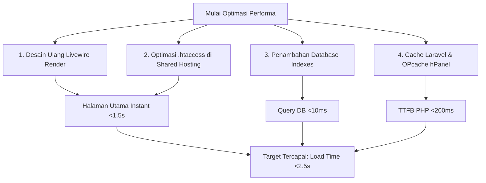

# Rencana Implementasi Optimasi Performa IBEKAMI (Shared Hosting)

Rencana ini bertujuan untuk memangkas waktu muat halaman utama https://ibekami.id/ hingga di bawah **2,5 detik** pada mobile dan desktop, khususnya bagi pengguna pertama (incognito/uncached) yang berada di jaringan rendah.

---

## 📊 Analisis Masalah Saat Ini

Shared hosting memiliki keterbatasan krusial pada **CPU Throttling**, **Disk I/O Limit**, dan **Concurrent Connections** (batas koneksi bersamaan). 

Berdasarkan analisis kode, ditemukan beberapa penyebab utama lambatnya loading awal:
1. **Anti-Pattern Livewire 3 Lazy Loading**: Ada **8 komponen `lazy`** di halaman utama (`welcome.blade.php`). Ketika halaman dimuat, Livewire langsung memicu **8 koneksi AJAX paralel** ke server PHP. Pada shared hosting, 8 koneksi ini mengantre (queuing) dan saling memblokir karena keterbatasan thread PHP server. Hal ini membuat halaman "pop-in" sangat lambat.
2. **Tanpa Gzip/Brotli & Browser Caching**: File `.htaccess` saat ini belum mengonfigurasi kompresi Gzip dan *Cache-Control* untuk aset statis (Vite CSS/JS, Fonts, WebP Images). Pengunjung baru harus mengunduh aset utuh tanpa kompresi (~2MB+).
3. **Pencarian File System yang Lambat**: Komponen seperti `BelanjaOnline`, `Mitra`, dan helper `resolveImageUrl` melakukan pemeriksaan fisik file (`Storage::disk()->exists` atau `file_exists`) di dalam server disk. Pada shared hosting, disk I/O lambat dan pemeriksaan ini memakan waktu berharga.
4. **Tanpa Database Indexing**: Query produk menyaring berdasarkan `status` dan mengurutkan berdasarkan `activated_at`/`created_at` tanpa indeks database, menyebabkan *full-table scan*.

---

## 🛠️ Usulan Solusi & Langkah Optimasi

Kami membagi optimasi ini dari yang paling **Krusial (Dampak Terbesar)** hingga **Pendukung (Dampak Tambahan)**.



---

## Proposed Changes

### 1. Re-arsitektur Rendering Livewire Halaman Utama (Sangat Krusial)

Kita akan menghilangkan atribut `lazy` pada komponen yang ringan atau sudah memiliki sistem Laravel Cache internal. 

- **Hero, BelanjaOnline, SosialMedia, Footer**: Tidak memiliki query database yang berat (bahkan `BelanjaOnline` dan `SosialMedia` hampir sepenuhnya statis). Menghilangkan `lazy` membuat komponen ini langsung dirender dalam satu request HTML awal tanpa memicu AJAX tambahan.
- **HotDeals, ProductSection, Mitra, Ulasan**: Data mereka sudah dibungkus dengan `Cache::remember` di backend (memakan waktu <2ms untuk query). Merendernya secara langsung (tanpa `lazy`) jauh lebih cepat karena mengeliminasi 7 AJAX request paralel yang membebani shared hosting.

#### [MODIFY] [welcome.blade.php](file:///C:/Users/USER/.gemini/antigravity/worktrees/ibekami_bckend/open-project-workspace/resources/views/welcome.blade.php)
Ubah pemanggilan Livewire menjadi normal (non-lazy) untuk menghemat 7 koneksi HTTP:
```diff
 @extends('layouts.app')

 @section('content')

-    {{-- Hero Section — above the fold, render langsung --}}
     <livewire:halaman-utama.hero />

-    {{-- Hot Deals — lazy: render setelah hero selesai --}}
-    <livewire:halaman-utama.hot-deals lazy />
+    <livewire:halaman-utama.hot-deals />

-    {{-- Product Section — lazy --}}
-    <livewire:halaman-utama.product-section lazy />
+    <livewire:halaman-utama.product-section />

-    {{-- Belanja Online — lazy --}}
-    <livewire:halaman-utama.belanja-online lazy />
+    <livewire:halaman-utama.belanja-online />

-    {{-- Sosial Media — lazy --}}
-    <livewire:halaman-utama.sosial-media lazy />
+    <livewire:halaman-utama.sosial-media />

-    {{-- Ulasan — lazy --}}
-    <livewire:halaman-utama.ulasan lazy />
+    <livewire:halaman-utama.ulasan />

-    {{-- Mitra — lazy --}}
-    <livewire:halaman-utama.mitra lazy />
+    <livewire:halaman-utama.mitra />

-    {{-- Footer — lazy --}}
-    <livewire:footer lazy />
+    <livewire:footer />

 @endsection
```

---

### 2. Optimasi `.htaccess` untuk Gzip Compression & Browser Cache (Sangat Krusial)

Menambahkan instruksi kompresi dan instruksi penyimpanan cache browser agar ukuran download awal berkurang hingga 75%.

#### [MODIFY] [.htaccess](file:///C:/Users/USER/.gemini/antigravity/worktrees/ibekami_bckend/open-project-workspace/public/.htaccess)
Tambahkan blok kompresi Gzip (`mod_deflate`) dan Browser Cache (`mod_expires`) di bagian atas file:
```apache
# ─── 1. GZIP COMPRESSION (Mengurangi Ukuran Transfer Aset) ───
<IfModule mod_deflate.c>
    # Aktifkan kompresi
    SetOutputFilter DEFLATE
    
    # Tentukan tipe file yang dikompres
    AddOutputFilterByType DEFLATE text/plain
    AddOutputFilterByType DEFLATE text/html
    AddOutputFilterByType DEFLATE text/xml
    AddOutputFilterByType DEFLATE text/css
    AddOutputFilterByType DEFLATE text/javascript
    AddOutputFilterByType DEFLATE application/xml
    AddOutputFilterByType DEFLATE application/xhtml+xml
    AddOutputFilterByType DEFLATE application/rss+xml
    AddOutputFilterByType DEFLATE application/javascript
    AddOutputFilterByType DEFLATE application/x-javascript
    AddOutputFilterByType DEFLATE application/x-httpd-php
    AddOutputFilterByType DEFLATE application/json
    AddOutputFilterByType DEFLATE image/svg+xml
    AddOutputFilterByType DEFLATE image/x-icon
    AddOutputFilterByType DEFLATE font/woff
    AddOutputFilterByType DEFLATE font/woff2
    AddOutputFilterByType DEFLATE font/ttf
    AddOutputFilterByType DEFLATE font/otf
    
    # Mengatasi bug browser jadul
    BrowserMatch ^Mozilla/4 gzip-only-text/html
    BrowserMatch ^Mozilla/4\.0[678] no-gzip
    BrowserMatch \bMSIE !no-gzip !gzip-only-text/html
</IfModule>

# ─── 2. BROWSER CACHING (Menyimpan Aset Statis di Browser Pengunjung) ───
<IfModule mod_expires.c>
    ExpiresActive On
    
    # Default expiry: 1 minggu
    ExpiresDefault "access plus 1 week"
    
    # CSS dan JavaScript: 1 tahun (Vite menggunakan hashing nama file, aman di-cache lama)
    ExpiresByType text/css "access plus 1 year"
    ExpiresByType text/javascript "access plus 1 year"
    ExpiresByType application/javascript "access plus 1 year"
    ExpiresByType application/x-javascript "access plus 1 year"
    
    # Gambar & Favicon: 1 tahun
    ExpiresByType image/gif "access plus 1 year"
    ExpiresByType image/png "access plus 1 year"
    ExpiresByType image/jpeg "access plus 1 year"
    ExpiresByType image/webp "access plus 1 year"
    ExpiresByType image/x-icon "access plus 1 year"
    ExpiresByType image/svg+xml "access plus 1 year"
    
    # WebM/MP4 Video: 1 bulan
    ExpiresByType video/webm "access plus 1 month"
    ExpiresByType video/mp4 "access plus 1 month"
    
    # Web Fonts (WOFF2, TTF): 1 tahun
    ExpiresByType font/woff2 "access plus 1 year"
    ExpiresByType font/woff "access plus 1 year"
    ExpiresByType font/ttf "access plus 1 year"
    ExpiresByType font/otf "access plus 1 year"
</IfModule>

# Hapus ETag untuk optimasi HTTP Header size
<IfModule mod_headers.c>
    Header unset ETag
</IfModule>
FileETag None
```

---

### 3. Penambahan Database Indexing untuk Kecepatan Query (Krusial)

Mempercepat proses pencarian dan penyaringan data di shared hosting MySQL.

#### [NEW] [2026_05_21_200000_add_performance_indexes_to_products_table.php](file:///C:/Users/USER/.gemini/antigravity/worktrees/ibekami_bckend/open-project-workspace/database/migrations/2026_05_21_200000_add_performance_indexes_to_products_table.php)
Buat migrasi untuk menambahkan indeks komposit pada `status` dan `activated_at` serta `created_at` karena kolom ini paling sering disaring dan diurutkan di halaman utama:
```php
<?php

use Illuminate\Database\Migrations\Migration;
use Illuminate\Database\Schema\Blueprint;
use Illuminate\Support\Facades\Schema;

return new class extends Migration
{
    public function up(): void
    {
        Schema::table('products', function (Blueprint $table) {
            // Indeks komposit untuk optimasi query halaman utama
            $table->index(['status', 'activated_at', 'created_at'], 'products_homepage_perf_index');
        });
    }

    public function down(): void
    {
        Schema::table('products', function (Blueprint $table) {
            $table->dropIndex('products_homepage_perf_index');
        });
    }
};
```

---

### 4. Tombol/Rute Khusus untuk Mengaktifkan Cache di Shared Hosting (Penting)

Shared hosting biasanya tidak menyediakan akses terminal SSH. Oleh karena itu, developer kesulitan menjalankan `php artisan optimize` di server produksi. Kita akan menambahkan rute khusus admin yang aman untuk melakukan optimasi cache satu kali klik.

#### [MODIFY] [web.php](file:///C:/Users/USER/.gemini/antigravity/worktrees/ibekami_bckend/open-project-workspace/routes/web.php)
Tambahkan rute aman di dalam grup middleware `admin`:
```php
// Rute di dalam group Route::prefix('admin')->middleware([...])->group(...)
Route::get('/optimize-server', function () {
    try {
        \Illuminate\Support\Facades\Artisan::call('config:cache');
        \Illuminate\Support\Facades\Artisan::call('route:cache');
        \Illuminate\Support\Facades\Artisan::call('view:cache');
        return back()->with('success', 'Optimasi server berhasil dijalankan! Konfigurasi, rute, dan blade view telah di-cache.');
    } catch (\Exception $e) {
        return back()->with('error', 'Gagal optimasi: ' . $e->getMessage());
    }
})->name('optimize-server');
```

#### [MODIFY] [dashboard.blade.php](file:///C:/Users/USER/.gemini/antigravity/worktrees/ibekami_bckend/open-project-workspace/resources/views/livewire/admin/dashboard.blade.php) (atau file sidebar/dashboard yang sesuai)
Tambahkan tombol "Optimalkan Server" di panel Dashboard Admin agar pemilik situs dapat menyegarkan cache kapan pun diperlukan dengan mudah.

---

### 5. Panduan Konfigurasi Server Produksi (Hostinger / cPanel)

Kami akan menulis panduan teknis yang detail bagi Anda untuk diterapkan langsung pada hPanel Hostinger / cPanel:
1. **Mengaktifkan OPcache**: Cara masuk ke PHP Settings Hostinger untuk memastikan ekstensi OPcache dicentang dan aktif.
2. **Konfigurasi PHP Version**: Merekomendasikan PHP 8.2 atau 8.3 yang memiliki efisiensi memori jauh lebih baik daripada PHP 8.0.
3. **Pengecekan HTTPS / HTTP2**: Memastikan SSL terpasang dengan benar untuk mengaktifkan protokol HTTP/2 secara otomatis.

---

## 🧪 Rencana Verifikasi

### Pengujian Lokal & Simulasi
1. Jalankan migrasi baru: `php artisan migrate`
2. Pastikan halaman utama memuat seluruh komponen tanpa ada error visual atau console log error.
3. Cek struktur HTML hasil kompilasi: semua bagian harus sudah terisi penuh di HTML pertama (tanpa skeleton placeholder Livewire).

### Pengujian Produksi (Setelah Deploy)
1. **Lighthouse Audit (Incognito/Uncached)**:
   - Target LCP: `< 2,5 detik` pada desktop & mobile.
   - Performa secara keseluruhan naik dari sub-50 ke **85+**.
2. **Network Tab (Chrome DevTools)**:
   - Verifikasi respons header CSS/JS/WebP memiliki `Content-Encoding: gzip` (atau `br`).
   - Verifikasi header memiliki `Cache-Control: max-age=31536000` (1 tahun) untuk aset statis.
   - Pastikan request AJAX `livewire/update` berkurang drastis di halaman utama.
