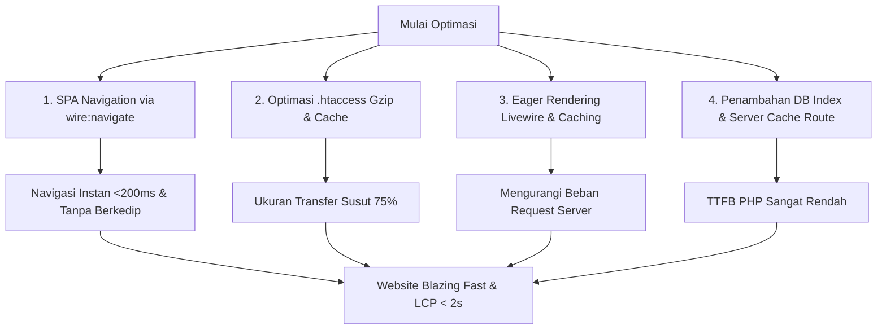

# Rencana Implementasi Optimasi Performa & Transisi Instan IBEKAMI (Shared Hosting)

Rencana ini diperbarui untuk menjawab tantangan **akses lambat di mode Incognito** dan **transisi halaman yang berat (Home ➔ Katalog ➔ Mesin)**. Target kita adalah memotong waktu loading awal di bawah **2,5 detik** dan membuat navigasi antar halaman menjadi **instan (<200ms)** seolah-olah menggunakan aplikasi mobile (SPA).

---

## 📊 Hasil Analisis & Penyebab Utama Lambat

Berdasarkan laporan **Diagnostics Hostinger** dan perilaku di mode **Incognito**:
1. **Full Page Reload Saat Navigasi**: Setiap klik menu memicu unduh ulang seluruh aset statis, inisialisasi ulang Livewire, dan booting Laravel dari nol (TTFB tinggi).
2. **Tanpa Kompresi Teks Gzip/Brotli (Document Request Latency = 0)**: Dokumen HTML dikirim mentah tanpa kompresi, memperlambat waktu respon awal.
3. **Masa Pakai Cache Tidak Efisien (Cache Lifetimes = 50)**: Aset statis tidak memiliki header *Cache-Control* yang agresif, sehingga browser harus sering memvalidasi ulang ke server.
4. **Banyak AJAX Paralel di Awal (Livewire 3 Lazy)**: Terdapat 8 komponen `lazy` di homepage yang saling mengantre pada shared hosting yang terbatas thread PHP-nya.

---

## 🛠️ Langkah Strategis & Rencana Perubahan Kode

Kami membagi langkah eksekusi menjadi 4 pilar utama yang saling melengkapi:



---

## Proposed Changes

### 1. Navigasi Instan (SPA Mode) dengan `wire:navigate` (Sangat Krusial)

Kita akan menambahkan atribut `wire:navigate` pada semua tautan (anchor tags `<a>`) internal di navbar dan footer. Ini akan menghilangkan proses reload halaman penuh, sehingga perpindahan halaman dari Home ke Katalog atau Mesin terasa instan dan tidak berkedip.

#### [MODIFY] [navbar.blade.php](file:///C:/Users/USER/.gemini/antigravity/worktrees/ibekami_bckend/open-project-workspace/resources/views/livewire/navbar.blade.php)
Tambahkan `wire:navigate` pada tautan internal:
- Home link: `<a href="{{ url('/') }}" wire:navigate ...>`
- Katalog link: `<a href="{{ route('katalog') }}" wire:navigate ...>`
- Mesin link: `<a href="{{ route('mesin') }}" wire:navigate ...>`
- Jenis Produk links di dropdown: `<a href="{{ route('katalog', ['type' => $type['slug']]) }}" wire:navigate ...>`

#### [MODIFY] [footer.blade.php](file:///C:/Users/USER/.gemini/antigravity/worktrees/ibekami_bckend/open-project-workspace/resources/views/livewire/footer.blade.php)
Tambahkan `wire:navigate` pada tautan internal:
- Privacy Policy: `<a href="{{ route('privacy-policy') }}" wire:navigate ...>`

---

### 2. Optimasi `.htaccess` untuk Gzip & Browser Caching (Sangat Krusial)

Kita akan memperbarui `.htaccess` agar server Hostinger mengompresi semua file teks secara otomatis (Gzip) dan menginstruksikan browser untuk menyimpan aset statis selama 1 tahun di penyimpanan lokal.

#### [MODIFY] [.htaccess](file:///C:/Users/USER/.gemini/antigravity/worktrees/ibekami_bckend/open-project-workspace/public/.htaccess)
Tambahkan modul kompresi dan masa kedaluwarsa cache di bagian atas file:
```apache
# ─── GZIP COMPRESSION (Mempercepat Download Awal Pengunjung Incognito) ───
<IfModule mod_deflate.c>
    SetOutputFilter DEFLATE
    AddOutputFilterByType DEFLATE text/plain
    AddOutputFilterByType DEFLATE text/html
    AddOutputFilterByType DEFLATE text/xml
    AddOutputFilterByType DEFLATE text/css
    AddOutputFilterByType DEFLATE text/javascript
    AddOutputFilterByType DEFLATE application/xml
    AddOutputFilterByType DEFLATE application/xhtml+xml
    AddOutputFilterByType DEFLATE application/rss+xml
    AddOutputFilterByType DEFLATE application/javascript
    AddOutputFilterByType DEFLATE application/x-javascript
    AddOutputFilterByType DEFLATE application/json
    AddOutputFilterByType DEFLATE image/svg+xml
    AddOutputFilterByType DEFLATE image/x-icon
    AddOutputFilterByType DEFLATE font/woff
    AddOutputFilterByType DEFLATE font/woff2
    AddOutputFilterByType DEFLATE font/ttf
</IfModule>

# ─── BROWSER CACHING (Menyimpan Aset Statis di Browser Pengunjung) ───
<IfModule mod_expires.c>
    ExpiresActive On
    ExpiresDefault "access plus 1 week"
    
    # CSS & JS (Vite menggunakan hash nama file, aman di-cache 1 tahun)
    ExpiresByType text/css "access plus 1 year"
    ExpiresByType text/javascript "access plus 1 year"
    ExpiresByType application/javascript "access plus 1 year"
    ExpiresByType application/x-javascript "access plus 1 year"
    
    # Aset Gambar & Font
    ExpiresByType image/png "access plus 1 year"
    ExpiresByType image/jpeg "access plus 1 year"
    ExpiresByType image/webp "access plus 1 year"
    ExpiresByType image/x-icon "access plus 1 year"
    ExpiresByType image/svg+xml "access plus 1 year"
    ExpiresByType font/woff2 "access plus 1 year"
    ExpiresByType font/woff "access plus 1 year"
    
    # Video Banner
    ExpiresByType video/webm "access plus 1 month"
    ExpiresByType video/mp4 "access plus 1 month"
</IfModule>

# Hapus ETag untuk menghemat ukuran HTTP Header
<IfModule mod_headers.c>
    Header unset ETag
</IfModule>
FileETag None
```

---

### 3. Re-arsitektur Rendering Livewire Halaman Utama (Krusial)

Kita akan menghilangkan parameter `lazy` pada pemanggilan komponen Livewire di `welcome.blade.php` untuk meredam tingginya request paralel ke PHP server. Data komponen-komponen ini sudah dibungkus dengan caching backend (`Cache::remember`), sehingga waktu pemrosesan query-nya sangat cepat (<2ms) dan tidak akan memperlambat load dokumen awal.

#### [MODIFY] [welcome.blade.php](file:///C:/Users/USER/.gemini/antigravity/worktrees/ibekami_bckend/open-project-workspace/resources/views/welcome.blade.php)
```diff
 @extends('layouts.app')

 @section('content')

-    {{-- Hero Section — render langsung --}}
     <livewire:halaman-utama.hero />

-    {{-- Hot Deals — lazy --}}
-    <livewire:halaman-utama.hot-deals lazy />
+    <livewire:halaman-utama.hot-deals />

-    {{-- Product Section — lazy --}}
-    <livewire:halaman-utama.product-section lazy />
+    <livewire:halaman-utama.product-section />

-    {{-- Belanja Online — lazy --}}
-    <livewire:halaman-utama.belanja-online lazy />
+    <livewire:halaman-utama.belanja-online />

-    {{-- Sosial Media — lazy --}}
-    <livewire:halaman-utama.sosial-media lazy />
+    <livewire:halaman-utama.sosial-media />

-    {{-- Ulasan — lazy --}}
-    <livewire:halaman-utama.ulasan lazy />
+    <livewire:halaman-utama.ulasan />

-    {{-- Mitra — lazy --}}
-    <livewire:halaman-utama.mitra lazy />
+    <livewire:halaman-utama.mitra />

-    {{-- Footer — lazy --}}
-    <livewire:footer lazy />
+    <livewire:footer />

 @endsection
```

---

### 4. Database Indexing & Sistem Caching Produksi Sekali-Klik (Penting)

- Menambahkan indeks database baru di tabel `products` untuk menyaring status aktif dan tanggal aktivasi secara kilat.
- Menyiapkan menu khusus di halaman Dashboard Admin yang memicu `Artisan::call('optimize')` secara instan, memudahkan pemilik situs untuk memperbarui cache meskipun tidak memiliki akses SSH di shared hosting.

#### [NEW] [2026_05_22_200000_add_performance_indexes_to_products_table.php](file:///C:/Users/USER/.gemini/antigravity/worktrees/ibekami_bckend/open-project-workspace/database/migrations/2026_05_22_200000_add_performance_indexes_to_products_table.php)
Membuat file migrasi indeks database.

#### [MODIFY] [web.php](file:///C:/Users/USER/.gemini/antigravity/worktrees/ibekami_bckend/open-project-workspace/routes/web.php)
Menambahkan route `/admin/optimize-server` di bawah pengamanan auth admin.

#### [MODIFY] [dashboard.blade.php](file:///C:/Users/USER/.gemini/antigravity/worktrees/ibekami_bckend/open-project-workspace/resources/views/livewire/admin/dashboard.blade.php)
Menambahkan tombol UI "Optimalkan Server" yang memicu route optimasi tersebut.

---

## 🧪 Rencana Verifikasi

### Pengujian Navigasi
1. Buka situs hasil deploy, klik menu **Katalog**, **Mesin**, dan **Home**.
2. **Hasil yang Diharapkan**: Halaman harus berpindah secara instan (<200ms) tanpa ada layar berkedip putih, dan tanpa mengunduh ulang stylesheet `app.css` atau JavaScript `app.js` di Tab Network Chrome DevTools.

### Pengujian Diagnostics Performa
1. Jalankan kembali tes PageSpeed / Lighthouse di mode Incognito.
2. Item "Document request latency" dan "Use efficient cache lifetimes" harus naik skornya karena Gzip dan Expires headers aktif.
3. Waktu interaksi pertama (First Input Delay / TBT) harus tetap sangat rendah di angka hijau.
