# 📊 Panduan Lengkap: Perincian LCP (LCP Breakdown) & Cara Mengoptimalkannya
*Berdasarkan Dokumentasi Resmi Google Chrome Developer & Analisis Performance Insights*

---

## 🔍 Apa itu Largest Contentful Paint (LCP)?

**Largest Contentful Paint (LCP)** adalah salah satu metrik utama dalam **Core Web Vitals** yang mengukur waktu render elemen visual (gambar, teks blok, atau video) terbesar yang ada di area pandang (*viewport*) pengguna sejak halaman pertama kali dimuat. 

LCP merupakan representasi terbaik dari seberapa cepat sebuah website dirasakan selesai dimuat oleh pengguna (*perceived load speed*). Target LCP yang ideal menurut standar industri adalah **di bawah 2.5 detik**.

---

## 🧩 Membedah 4 Subbagian LCP (LCP Breakdown)

Untuk mempermudah proses diagnosis performa dan penemuan *bottlenecks*, Chrome DevTools membagi total waktu LCP ke dalam **4 subbagian (fase) utama**. 

> [!TIP]
> **Prinsip Utama Optimasi LCP**: Idealnya, sebagian besar waktu LCP harus dihabiskan untuk **fase pemuatan aset (Resource Load Duration)**, bukan pada fase penundaan penundaan (*delays*).

```mermaid
gantt
    title Anatomi Alur Waktu LCP
    dateFormat  X
    axisFormat %s
    
    section Siklus LCP
    1. TTFB (Waktu Respons Server)                 :active, ttfb, 0, 10
    2. Jeda Muat Sumber Daya (Load Delay)        :crit, delay, 10, 18
    3. Durasi Muat Sumber Daya (Load Duration)   :active, duration, 18, 30
    4. Jeda Render Elemen (Render Delay)          :crit, render, 30, 35
```



Berikut adalah penjelasan mendalam mengenai ke-4 fase LCP beserta fokus optimasinya:

### 1. Time to First Byte (TTFB)
*   **Penjelasan**: Waktu yang dibutuhkan sejak pengguna pertama kali memicu navigasi hingga browser menerima byte pertama dari respons dokumen HTML utama dari server web.
*   **Signifikansi**: Fase ini adalah gerbang pembuka. Jika TTFB lambat, fase-fase berikutnya secara otomatis akan tertunda dengan durasi yang sama.
*   **Fokus Optimasi**: 
    *   Mempercepat waktu respons server backend (misalnya PHP, Node.js).
    *   Mengurangi kueri database yang berat atau tidak efisien (*N+1 query issues*).
    *   Memanfaatkan *full-page caching* (seperti Redis, Varnish, atau CDN).

### 2. Penundaan Pemuatan Sumber Daya (Resource Load Delay)
*   **Penjelasan**: Jeda waktu dari saat dokumen HTML awal selesai diunduh (TTFB) hingga browser benar-benar memulai pengunduhan aset LCP (seperti file gambar atau video utama). Jika elemen LCP berupa teks biasa (bukan gambar/video), nilai fase ini adalah **0**.
*   **Penyebab Penundaan**: Browser tidak menyadari bahwa aset tersebut sangat kritis. Hal ini sering terjadi jika gambar LCP disembunyikan di dalam CSS (*background-image*) atau baru dimuat melalui script JavaScript eksternal setelah DOM selesai dibangun.
*   **Fokus Optimasi**:
    *   **Hindari `loading="lazy"`** pada gambar LCP (gambar pertama di atas lipatan layar). Gambar LCP harus dimuat secara **eager** (prioritas tinggi).
    *   Tulis tag `` atau `<picture>` langsung di dalam markup HTML agar bisa ditemukan lebih cepat oleh browser *Preload Scanner*.
    *   Gunakan `<link rel="preload">` di dalam `<head>` jika gambar LCP menggunakan background CSS atau disuntikkan secara dinamis.

### 3. Durasi Pemuatan Sumber Daya (Resource Load Duration)
*   **Penjelasan**: Waktu aktual yang dihabiskan oleh browser untuk mengunduh aset gambar/video LCP tersebut dari jaringan internet. Jika LCP berupa teks biasa, fase ini bernilai **0**.
*   **Signifikansi**: Dipengaruhi langsung oleh ukuran file aset dan kualitas jaringan pengguna.
*   **Fokus Optimasi**:
    *   Memperkecil ukuran file gambar dengan mengonversinya ke format modern seperti **WebP** atau **AVIF**.
    *   Menerapkan tingkat kompresi cerdas di kisaran **75% - 82%** untuk memangkas byte berlebih.
    *   Gunakan atribut `srcset` dan `sizes` (gambar responsif) agar browser hanya mengunduh ukuran gambar yang sesuai dengan dimensi perangkat.

### 4. Penundaan Render Elemen (Element Render Delay)
*   **Penjelasan**: Jeda waktu dari saat aset LCP selesai diunduh sepenuhnya hingga elemen tersebut benar-benar digambar (*painted*) di layar pengguna.
*   **Penyebab Penundaan**: Browser terhambat oleh proses lain, seperti sedang mengunduh dan memproses berkas CSS/JS besar yang memblokir rendering (*render-blocking resources*), atau thread utama CPU sedang sibuk mengeksekusi JavaScript.
*   **Fokus Optimasi**:
    *   Minimalkan atau tunda (*defer* / *async*) pemuatan JavaScript dan CSS yang memblokir rendering.
    *   Pisahkan CSS kritis (*critical CSS*) untuk langsung disuntikkan (*inline*) di dalam HTML, dan muat sisa CSS secara asinkron.
    *   Pastikan struktur DOM tidak terlalu kompleks dan hindari eksekusi script besar tepat saat halaman pertama kali termuat.

---

## 🎯 Cara Lolos dari Pemeriksaan Insight Ini

Untuk mendapatkan tanda hijau dan skor performa terbaik di Google Lighthouse maupun Chrome DevTools:

1.  **Pertahankan LCP di bawah 2.5 detik** pada kondisi jaringan nyata.
2.  **Kurangi jeda (Delay) seminimal mungkin**: Jeda muat (*Load Delay*) dan jeda render (*Render Delay*) harus diusahakan mendekati **0**.
3.  **Terapkan Prioritas Tinggi**: Berikan atribut `fetchpriority="high"` pada gambar LCP agar browser memprioritaskan antrean download-nya di atas aset-aset lainnya.

```html
<!-- Contoh Tag Gambar LCP Terbaik di Atas Lipatan Layar -->

```
